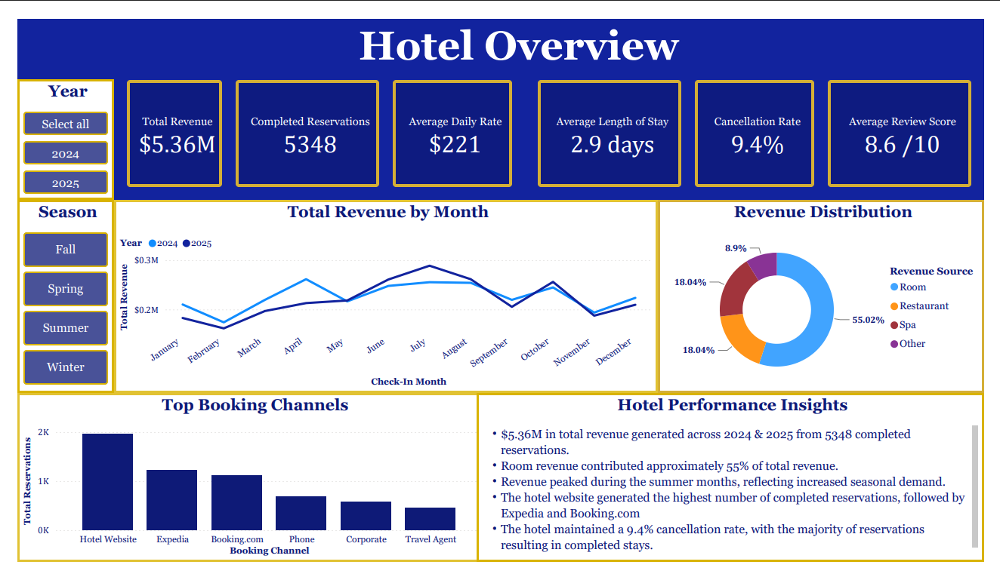

# Hotel Business Dashboard | Power BI
Interactive Power BI dashboard analyzing hotel revenue, reservations, booking channels, and guest behavior using DAX measures and business intelligence analytics.

## Project Overview
This project uses Power BI, DAX, and Power Query to analyze hotel performance across 2024 and 2025. The dashboard explores revenue, completed reservations, booking channels, seasonal trends, average daily rate, cancellations, and guest review scores through interactive visualizations.

## Dashboard Preview

## Business Questions
- How is the hotel performing overall?
- How does revenue vary throughout the year?
- Which revenue sources contribute the most?
- Which booking channels generate the most reservations?
- What percentage of reservations are cancelled?
- How do performance trends compare between 2024 and 2025?

## Dashboard Metrics
- Total Revenue
- Completed Reservations
- Average Daily Rate
- Average Length of Stay
- Cancellation Rate
- Average Review Score

## Key Findings
  - Total revenue reached $5.36 million across 2024 and 2025, with approximately 5,348 completed reservations, demonstrating strong overall business performance.
  - Room revenue was the hotel's largest revenue source, contributing approximately 55% of total revenue.
  - Revenue remained relatively consistent throughout both years, with seasonal peaks during the summer months, indicating increased demand during peak travel season.
  - The hotel website was the highest-performing booking channel, generating the greatest number of completed reservations, followed by Expedia and Booking.com.
  - The hotel maintained a 9.4% cancellation rate, indicating that the majority of reservations resulted in completed stays.
 
## Tools Used
- **Power BI** – Built an interactive dashboard featuring cards, charts, slicers, and report pages to analyze hotel performance and support interactive data exploration.

- **DAX** – Created measures to calculate key performance metrics, including total revenue, completed reservations, average daily rate, average length of stay, cancellation rate, revenue distribution, and review scores.

- **Power Query** – Prepared and transformed the hotel reservation dataset by validating data types, formatting date fields, and creating supporting fields for accurate reporting and chronological analysis.

- **Data Visualization** – Designed intuitive visualizations, including cards, line charts, donut charts, and bar charts, to effectively communicate revenue trends, booking performance, and operational insights.

- **Business Intelligence Analytics** – Analyzed hotel reservation data to evaluate financial performance, identify revenue and booking trends, monitor key performance indicators (KPIs), and deliver actionable insights through an interactive dashboard

 ## Files
 - 'HotelAnalysis.pbix' - Interactive Power BI report
 - 'data/hotel_reservations.csv' - Hotel reservation dataset generated by ChatGPT
 - 'images/hotel_overview.png' - Dashboard Preview Screenshot

## Skills Demonstrated in this Project
- Data cleaning and transformation
- DAX measure creation
- Power BI dashboard development
- Interactive report design
- Business Performance analysis
- Data visualization
- Data storytelling

 
